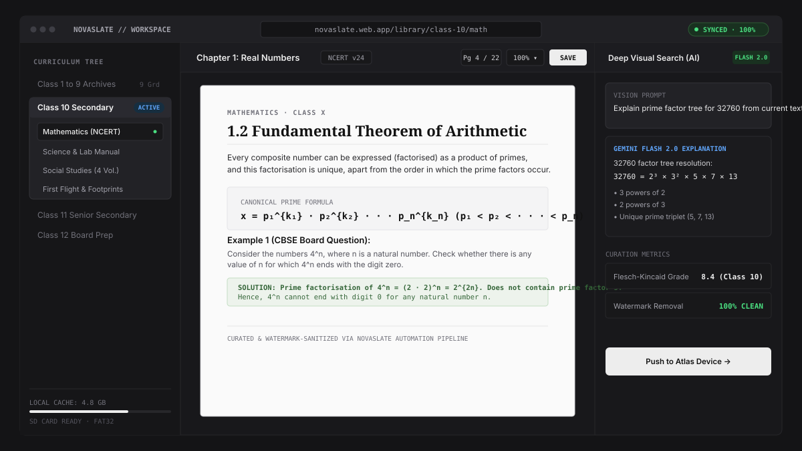

# NovaSlate

<p align="center">
  
</p>

<p align="center">
  <strong>Automated Educational Content Management &amp; Curriculum Delivery Platform for K–12 Education</strong>
</p>

<p align="center">
  <a href="https://github.com/Reyansh-Niranjan/novaslate/stargazers">
    
  </a>
  <a href="https://github.com/Reyansh-Niranjan/novaslate/issues">
    
  </a>
  <a href="https://github.com/Reyansh-Niranjan/novaslate/commits/main">
    
  </a>
  <a href="https://github.com/Reyansh-Niranjan/novaslate/actions">
    
  </a>
  <a href="https://github.com/Reyansh-Niranjan/novaslate/blob/main/LICENSE">
    
  </a>
</p>

<p align="center">
  
  
  
  
  
  
</p>

<p align="center">
  <a href="#overview">Overview</a> •
  <a href="#key-capabilities">Key Capabilities</a> •
  <a href="#system-architecture">Architecture</a> •
  <a href="#tech-stack">Tech Stack</a> •
  <a href="#hardware-companion">Atlas Device</a> •
  <a href="#creator">Creator</a>
</p>

---

## Overview

**NovaSlate** is an automated educational content management and curriculum delivery platform designed for Indian K–12 schools, educators, and students. Instead of manually scouring dozens of websites for scattered textbooks and lesson resources, NovaSlate continuously indexes, grades readability, and organizes state board and NCERT curriculum materials into a unified digital library.

### Problems Solved
- ⏰ **Curriculum Discovery Grunt Work** — Automates resource finding and eliminates manual downloading.
- 📚 **Broken Structuring & Missing Taxonomies** — Automatically categorizes textbooks from Class 1 through Class 12.
- 🔍 **Diagram & Visual Querying** — Multimodal vision AI understands equations, graphs, and textbook figures.
- 📡 **Offline & Low-Connectivity Resilience** — Companion **Atlas** hardware device caches curricula onto SD cards for rural environments.

---

## Key Capabilities

### 📖 Class 1–12 Digital Library
- **Structured Hierarchy:** Browse by grade level, subject taxonomy, and chapter streams.
- **In-Browser Reader:** Full-screen reader with zoom, keyboard navigation, and instant download.
- **Watermark Cleaned:** Processed PDFs stripped of visual artifacts for clean printing and study.

### 🤖 AI Assistant & Deep Visual Search
- **Multimodal Vision:** Streams textbook pages directly to **Gemini 2.0 Flash** via OpenRouter for diagram explanation.
- **Context-Aware Assistance:** Helps students navigate topics directly aligned with their grade level.

<a id="hardware-companion"></a>
### ⚡ Dual Ecosystem: Cloud + Embedded Hardware
- **Web Platform:** Cloud-orchestrated web application powered by Supabase Storage and PostgreSQL.
- **Atlas Device:** Autonomous ESP32 micro-device featuring an SD card reader and custom C++ display engine for classrooms without internet.

---

## System Architecture

```
NovaSlate
├── 🌐 Web Frontend (React 19, TypeScript, Tailwind CSS, Vite)
│   ├── Landing Page (Precision Minimalist Bento Grid)
│   ├── User Workspaces (Student, Teacher, Admin)
│   ├── In-Browser PDF Reader
│   └── Vision AI Assistant
│
├── 📦 Content Delivery (Supabase Storage CDN)
│   ├── Class1/ through Class12/ (Optimized PDF archives)
│   └── structure.json & catalog.json
│
├── 🗄️ Backend Services (Supabase)
│   ├── JWT Authentication & User Profiles
│   ├── Row-Level Security (RLS)
│   └── Content Metadata & Activity Logs
│
└── 📟 Embedded Hardware (Atlas-Device)
    ├── ESP32 Dual-Core Microcontroller
    ├── Offline SD Card Storage Partition
    └── Low-Memory C++ Rendering Engine
```

---

## Tech Stack

| Layer | Technologies |
|---|---|
| **Frontend UI** | React 19, TypeScript, Tailwind CSS, Radix UI Primitives, Lucide Icons, Framer Motion, GSAP |
| **Typography** | Geist Sans, Geist Mono, Instrument Serif |
| **Backend & DB** | Supabase (PostgreSQL, Auth, RLS) |
| **Storage & CDN** | Supabase Storage Content Delivery |
| **AI Models** | Gemini 2.0 Flash (OpenRouter) |
| **Hardware** | Atlas (ESP32, C++, MicroSD FAT32) |

---

## Contributors

<p align="center">
  <a href="https://github.com/Reyansh-Niranjan/novaslate/graphs/contributors">
    
  </a>
</p>

---

## Creator

**Reyansh Niranjan** — Creator, Architect & Lead Developer (Web Platform, Scraper Pipeline & Atlas ESP32 Offline Device).

---

## License

Distributed under the project license. See [LICENSE](LICENSE) for more information.
